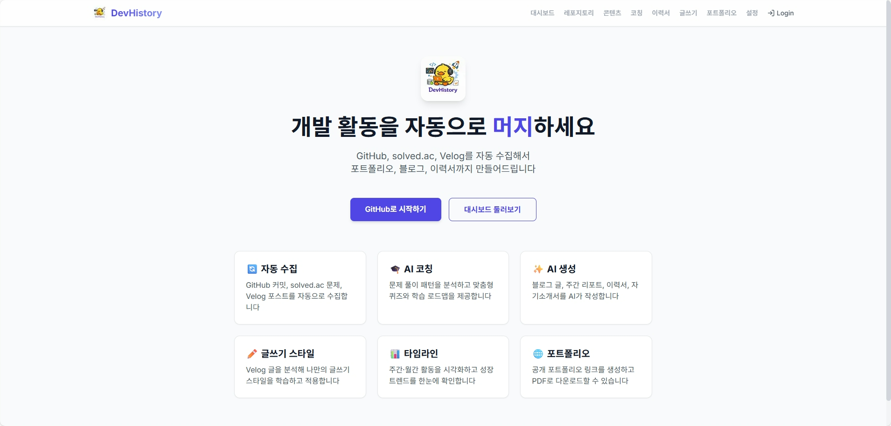
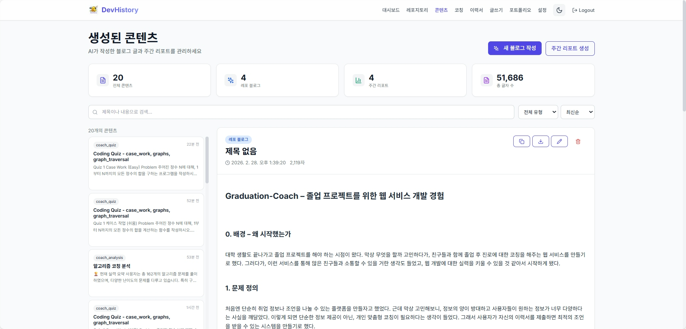

# DevHistory - Dev Activity Auto-Portfolio



**DevHistory는 개발자의 활동 로그를 자동으로 모아서 포트폴리오로 재사용할 수 있게 만드는 서비스입니다.**

개발자, 특히 학생/주니어는 GitHub에 커밋하고, 백준/solved.ac에서 문제 풀고, 노트/블로그도 쓰지만,  
정작 이걸 **정리해서 포트폴리오나 회고 글로 남기는 작업은 거의 하지 않습니다.**

DevHistory의 목표는 단순히 "글을 대신 써주는 AI"가 아니라,

> 내가 이미 한 활동들(GitHub, solved.ac, 노트, 블로그)을  
> 자동으로 수집하고 구조화해서,  
> **주간/월간 히스토리, 블로그 글, 포트폴리오 섹션, 이력서 문장으로 쉽게 뽑아내게 해주는 것**입니다.

즉, "ChatGPT에 URL 던져서 요약하는 도구"가 아니라,  
**개발자의 활동 데이터를 장기적으로 기록/분석하고,  
그 위에 포트폴리오/블로그/리포트를 올릴 수 있는 개인 개발 라이프 로그 플랫폼**을 지향합니다.

---

## 🎯 Core Concepts

DevHistory는 네 가지 핵심 개념으로 구성됩니다.

### 1. 자동 수집 (MergeCollector)

- **GitHub OAuth, solved.ac 핸들, 블로그 연동**을 해두면 커밋/레포, 푼 문제, 작성 글을 주기적으로 자동 수집해서 DB에 쌓습니다.
- 수집 대상:
  - **GitHub**: 레포지토리, 커밋 내역
  - **solved.ac**: 푼 문제, 난이도, 태그/유형
  - **Velog**: 블로그 글 메타데이터 (RSS)
  - **노트**: 업로드 또는 Notion 연동 (예정)

**결과:** 내가 별도로 정리하지 않아도, 개발/공부 활동 로그가 한 곳에 쌓입니다.

### 2. 히스토리 & 분석 (MergeTimeline)

- "이번 주 / 이번 달에 내가 뭘 했는지"를 커밋 수, 푼 문제 수, 태그/유형 비율, 레포별 기여도 같은 형태로 집계합니다.
- 이 데이터를 기반으로:
  - 주간/월간 타임라인
  - 지표/그래프 (예: 날짜별 활동량, 문제 유형 분포, 레포별 활동량)

**결과:** "열심히 한 것 같은데 뭐 했는지 기억 안 나는 상태"에서 벗어나, 실제 활동이 시간축과 지표로 보이게 됩니다.

### 3. 원클릭 아웃풋 (MergeForge)

- 이렇게 쌓인 데이터를 기반으로 **버튼 한 번**에:
  - 주간/월간 개발 회고 글
  - 특정 레포를 중심으로 한 프로젝트 블로그 글
  - 포트폴리오 카드/이력서 bullet
- AI가 포폴을 "지어내는" 게 아니라, **실제 활동 로그를 사람이 읽기 좋은 형태로 변환**하는 층입니다.

**결과:** 이미 했던 일을 바탕으로, 회고/블로그/포폴 텍스트를 "초안 수준"까지 자동으로 끌어올리고, 사용자는 마지막 다듬기만 하면 됩니다.

### 4. 일관된 스타일/템플릿 (MergeStyler)

- 사용자별로 **언어, 말투, 섹션 구조**를 스타일 프로필로 저장합니다.
  - 예: `Intro -> Problem -> Approach -> Result -> Next`
- 이 스타일을 자동 생성 글에 적용합니다.

**결과:** 포트폴리오/블로그/리포트가 전부 **같은 톤과 구조로 쌓이게** 되어, 나중에 봐도 일관된 "나만의 스타일"이 유지됩니다.

---

## 🔄 Pipeline Overview

DevHistory의 전체 동작 흐름은 다음과 같습니다.

### 1. 계정 연동 & 스타일 설정

- GitHub OAuth로 로그인
- solved.ac 핸들, 블로그 ID(예: Velog) 등록
- 언어/톤/섹션 구조 등 개인 스타일 프로필 설정

### 2. 활동 자동 수집 (MergeCollector)

- 주기적으로 GitHub/solved.ac/블로그에서 활동 로그를 가져와 DB에 누적
- 새로운 레포, 커밋, 문제 풀이, 글 작성이 있으면 계속 쌓임

### 3. 주간/월간 집계 & 히스토리 생성 (MergeTimeline)

- 일정 주기마다 최근 1주/1달 데이터를 집계
- 커밋 수, 문제 수, 날짜별 활동량, 문제 유형 분포, 레포별 기여도 등을 계산
- 대시보드와 리포트 리스트에 표시할 수 있는 형태로 정리

### 4. 콘텐츠 생성 요청 (MergeForge)

- 사용자가 UI에서 "이 주차 회고 생성", "이 레포 블로그 글 생성" 버튼 클릭
- MergeForge가:
  - 해당 기간/레포의 집계 데이터 + 중요 로그를 모아서
  - MergeStyler의 스타일 프로필을 system prompt에 적용한 뒤
  - LLM(OpenAI 등)을 호출해 Markdown 초안을 생성

### 5. 검토 & 재사용

- 생성된 텍스트는:
  - 리포트/콘텐츠 페이지에서 바로 확인
  - 블로그(Velog 등)에 복붙 또는 편집 후 게시
  - 포트폴리오/이력서용 섹션으로 재사용
- 사용자는 **"생산보다 검토/수정에 집중"**할 수 있게 됩니다.

이 파이프라인을 통해, **"데이터 수집 + 누적 + 분석 + 한 방에 아웃풋"** 흐름이 완성됩니다.

---

## 📸 스크린샷

### 대시보드


_개발 활동 통계와 트렌드를 한눈에_

### 포트폴리오


_자동 생성된 포트폴리오 페이지_

### 생성된 블로그 글



_LLM이 작성한 기술 블로그 초안_

---

## 📁 프로젝트 구조

```text
devhistory/
├── apps/
│   ├── api/                  # FastAPI 백엔드
│   │   ├── app/              # API 서버
│   │   │   ├── routers/      # REST API 엔드포인트
│   │   │   └── models/       # 데이터베이스 모델
│   │   └── worker/           # Celery 백그라운드 작업
│   └── web/                  # Next.js 프론트엔드
│       └── app/              # App Router 페이지
├── packages/                 # 공통 Python 패키지
│   ├── merge_core/           # LLM, 설정 등 핵심 유틸
│   ├── merge_collector/      # GitHub, solved.ac, Velog 수집
│   ├── merge_timeline/       # 주간/월간 집계 및 타임라인
│   ├── merge_forge/          # LLM 콘텐츠 생성 (회고, 블로그)
│   └── merge_styler/         # 스타일 프로필 관리
├── infra/
│   ├── docker-compose.yml
│   ├── docker-compose.prod.yml
│   └── migrations/           # Alembic DB 마이그레이션
└── docs/
    ├── ARCHITECTURE.md
    ├── API_SPEC.md
    └── DEPLOYMENT.md
```

---

## 🛠 기술 스택

### Frontend

- **Next.js 14** (App Router) + TypeScript
- **Tailwind CSS** - 스타일링
- **Framer Motion** - 인터랙션/애니메이션

### Backend

- **FastAPI** - 웹 프레임워크
- **SQLAlchemy** + **Alembic** - ORM 및 마이그레이션
- **PostgreSQL** - 관계형 데이터베이스
- **Celery** + **Redis** - 비동기 작업 큐 & 스케줄링

### Authentication & External APIs

- **GitHub OAuth** - 로그인 및 본인 소유 레포지토리 접근 (`affiliation=owner`)
- **solved.ac API** - 문제 풀이 데이터
- **Velog RSS** - 블로그 포스트 수집
- **OpenAI API** - LLM 콘텐츠 생성

### Infrastructure

- **Docker Compose** - 멀티 컨테이너 오케스트레이션
- **Caddy** - 프로덕션 HTTPS 리버스 프록시
- **JWT + httpOnly Cookie** - 인증 세션

---

## 🚀 빠른 시작

### 사전 요구사항

- Docker Desktop (Compose v2)
- GitHub 계정 (OAuth 앱 생성용)
- Python 3.11+ (최초 마이그레이션 실행용)
- OpenAI API Key (선택)
  - 서버 공용 키를 쓰지 않으면 사용자 BYO Key 방식으로 사용 가능

### 1단계: 환경 변수 설정

```powershell
Copy-Item .env.example .env
```

`.env` 파일에서 최소 다음 값을 설정하세요:

```env
GITHUB_CLIENT_ID=your-github-client-id
GITHUB_CLIENT_SECRET=your-github-client-secret
JWT_SECRET=your-secret-key-change-this
GITHUB_REDIRECT_URI=http://localhost:8000/api/auth/github/callback

# 선택 (서버 공용 LLM 키)
OPENAI_API_KEY=your-openai-api-key
```

### 2단계: GitHub OAuth 앱 생성

1. https://github.com/settings/developers 접속
2. **New OAuth App** 클릭
3. 다음 정보 입력:
   - **Application name**: `DevHistory (Dev)`
   - **Homepage URL**: `http://localhost:3000`
   - **Authorization callback URL**: `http://localhost:8000/api/auth/github/callback`
4. **Client ID**와 **Client Secret**을 `.env`에 복사

### 3단계: Docker로 실행

```powershell
docker compose -f infra/docker-compose.yml up -d --build
```

### 4단계: 데이터베이스 초기화 (최초 1회)

```powershell
python -m venv .venv
.\.venv\Scripts\activate
pip install -e .
$env:PYTHONPATH="$PWD\apps\api;$PWD\packages"
alembic -c infra/alembic.ini upgrade head
```

### 5단계: 접속

- **Frontend**: http://localhost:3000
- **Backend API**: http://localhost:8000
- **API Docs (Swagger)**: http://localhost:8000/docs

### 로컬 개발 모드 (Docker 없이)

자세한 내용은 [GETTING_STARTED.md](GETTING_STARTED.md)를 참고하세요.

---

## 💡 연동 가능한 서비스

### ✅ 현재 지원

- **GitHub** - OAuth 인증을 통한 레포지토리/커밋 접근
- **solved.ac** - 핸들 기반 공개 API 접근
- **Velog** - RSS 피드를 통한 블로그 포스트 메타데이터 수집

### 🔜 향후 지원 예정

- **Notion** - 노트/문서 연동
- **추가 블로그 플랫폼** - Tistory, Medium 등

**참고**

- solved.ac/Velog는 공개 API/RSS 기반이라 핸들/ID로 수집 가능합니다.
- GitHub은 OAuth 권한 범위에 따라 private 레포 접근 여부가 달라집니다.

---

## 📝 주요 기능

### 대시보드

- 전체/주간 활동 요약 (총 커밋, 레포지토리, 문제 풀이, 블로그 글)
- 주간 증감 트렌드 (절대값 차이 기반 표시)
- 커밋 트렌드 그래프 및 언어 분포 차트
- 빠른 실행 버튼 (GitHub/Velog/Solved.ac 동기화)

### 주간 리포트

- 자동 집계된 주간 활동 통계
- AI 생성 회고 글 (Markdown)
- 스타일 프로필 기반 결과물 생성
- 복사/재사용 가능한 결과 포맷

### 레포지토리 관리

- 본인 소유 레포 자동 동기화 (`owner` 기준)
- GitHub 실제 생성/수정 시각 보존
- 레포별 상세 정보 및 최근 커밋 조회
- 레포 기반 블로그 글 자동 생성

### 코딩 코치

- solved.ac 기반 풀이 패턴 분석
- 코딩 퀴즈 생성
- 비동기 생성 상태 폴링으로 "대기 후 실패처럼 보이는 문제" 완화
- 코칭 히스토리 조회

### 생성 콘텐츠 관리

- 생성된 블로그/리포트 목록 조회
- 수정/삭제/재생성
- Markdown 렌더링 프리뷰

### 포트폴리오

- 자동 집계된 활동 통계
- 상위 프로젝트/기술 스택 시각화
- **공개 포트폴리오 URL(slug)** + **비공개 공유 링크(token)**
- 공유 토큰 재발급 및 이메일 공개 여부 제어
- **PDF 내보내기 (캡처 방식)**
  - `html2canvas + jsPDF`
  - 캡처 전 폰트/이미지 렌더 대기 처리(이모지 누락 완화)

### 이력서/자기소개서

- 포트폴리오 데이터 기반 생성
- Markdown 복사/다운로드
- 생성 히스토리 조회

### 관리자 기능

- PV/UV, DAU/MAU, 상위 페이지 조회
- 특정 GitHub 사용자만 관리자 접근 허용

---

## 🎯 Project Purpose

원래는 제가 제 GitHub/solved.ac/블로그 활동을 자동으로 기록/정리하려고 만든 **개인용 서비스**입니다.

- 과제, 대회, 개인 프로젝트, 알고리즘 풀이를 하다 보면 "내가 뭘 얼마나 했는지" 정리하기가 번거롭고,
- 포트폴리오/블로그를 쓰려면 다시 로그를 모으고, 회고를 쓰고, 구조를 잡는 과정이 반복됩니다.

그래서,

> "내가 이미 하고 있는 활동을 최대한 자동으로 모으고,  
> 그걸 기반으로 포폴/블로그/회고를 쉽게 뽑아내자"

는 목적을 가지고 DevHistory를 만들었습니다.

구조와 설계는 처음부터 **다중 사용자와 실제 운영**을 고려했습니다.  
(계정 연동, 배치 작업, DB 스키마, LLM 통합, 보안 설정)

---

## 📊 Current Status

**✅ 핵심 기능 운영 가능 상태 (2026.03 기준)**

- **자동 수집**: GitHub / Velog / solved.ac
- **대시보드**: 통계, 트렌드, 차트
- **코칭**: 분석 + 퀴즈 생성(비동기 폴링 포함)
- **포트폴리오**: 공유 링크 + PDF 내보내기
- **LLM 생성**: 주간 리포트, 레포 기반 콘텐츠
- **콘텐츠 관리**: 수정/삭제/재생성/프리뷰
- **BYO LLM 키 관리**: 저장/검증/테스트/삭제
- **로그인 흐름 개선**: OAuth 로그인 직후 GitHub sync 자동 큐잉

현재는 비용/운영 정책상 퍼블릭 SaaS로 완전 공개 운영 중은 아니며,  
로컬/개인 배포 또는 소규모 운영 전제로 사용하고 있습니다.

---

## ✨ Highlights

이 프로젝트는 단순한 개인 스크립트가 아니라, 아래를 한 번에 다루는 풀스택 프로젝트입니다.

- OAuth 기반 인증/권한 흐름
- FastAPI + Celery + Redis 비동기 파이프라인
- PostgreSQL + Alembic 스키마 마이그레이션
- 활동 데이터 수집/집계/생성까지 이어지는 end-to-end 흐름
- 사용자별 LLM 키(BYO) 암호화 저장 및 검증
- 포트폴리오 공유/배포를 고려한 공개 URL 설계

목표는:

> "개발자 인생을 대신 살아주는 도구"가 아니라,  
> **이미 쌓인 개발 활동을 데이터로 정리해서  
> 포트폴리오와 기록으로 재사용하기 쉽게 만드는 도구**

입니다.

---

## 📚 문서

- [시작 가이드](GETTING_STARTED.md)
- [아키텍처](docs/ARCHITECTURE.md)
- [API 명세](docs/API_SPEC.md)
- [배포 가이드](docs/DEPLOYMENT.md)
- [운영 가이드](docs/OPERATIONS.md)
- [보안 가이드](docs/SECURITY.md)

---

## 🤝 Contributing

1. Fork the Project
2. Create your Feature Branch (`git checkout -b feature/AmazingFeature`)
3. Commit your Changes (`git commit -m 'Add some AmazingFeature'`)
4. Push to the Branch (`git push origin feature/AmazingFeature`)
5. Open a Pull Request

---

## 📘 More Details

DevHistory의 설계/개발 과정과 회고는 아래 블로그에서 확인할 수 있습니다.

- [DevHistory - 개발 포트폴리오 자동화 플랫폼 만들기 (Velog)](https://velog.io/@lova-clover/DevHistory-%EA%B0%9C%EB%B0%9C-%ED%8F%AC%ED%8A%B8%ED%8F%B4%EB%A6%AC%EC%98%A4-%EC%9E%90%EB%8F%99%ED%99%94-%ED%94%8C%EB%9E%AB%ED%8F%BC-%EB%A7%8C%EB%93%A4%EA%B8%B0)

- [[DevHistory] 토이에서 서비스로, 배포 직전 트러블슈팅 정리 (Velog)](https://velog.io/@lova-clover/DevHistory-%ED%86%A0%EC%9D%B4%EC%97%90%EC%84%9C-%EC%84%9C%EB%B9%84%EC%8A%A4%EB%A1%9C-%EB%B0%B0%ED%8F%AC-%EC%A7%81%EC%A0%84-%ED%8A%B8%EB%9F%AC%EB%B8%94%EC%8A%88%ED%8C%85-%EC%A0%95%EB%A6%AC)

---

## 📄 License

MIT License

---

**DevHistory** - Made with care for developers who want to turn daily activities into meaningful portfolios.
